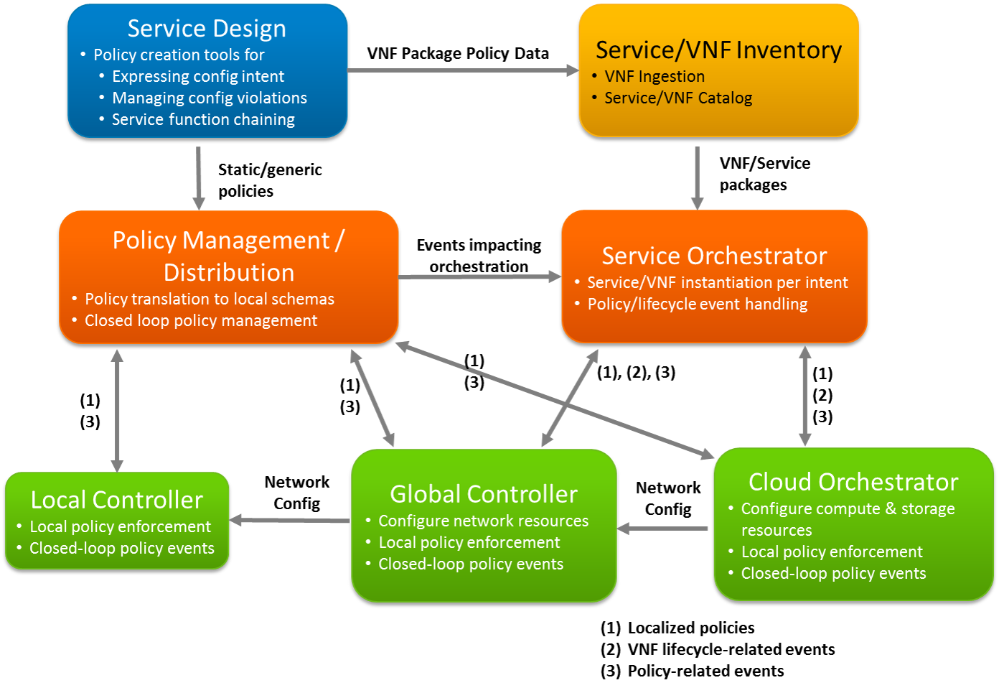

.. This work is licensed under a
.. Creative Commons Attribution 4.0 International License.
.. http://creativecommons.org/licenses/by/4.0
.. (c) 2015-2017 AT&T Intellectual Property, Inc

Architecture
============

Architectural Concept
---------------------
The following example diagram illustrates a "relationship diagram" type view of
an NFVI platform, in which the roles of components focused on policy management,
services, and infrastructure are shown.

This view illustrates that a large-scale deployment of NFVI may leverage multiple
components of the same "type" (e.g. SDN Controller), which fulfill specific
purposes for which they are optimized. For example, a global SDN controller and
cloud orchestrator can act as directed by a service orchestrator in the
provisioning of VNFs per intent, while various components at a local and global
level handle policy-related events directly and/or feed them back through a
closed-loop policy design that responds as needed, directly or through the
service orchestrator.

(source of the diagram above:
https://git.opnfv.org/cgit/copper/plain/design_docs/images/policy_architecture.pptx)

Architectural Aspects
---------------------
  * Policies are reflected in two high-level goals

    * Ensure resource requirements of VNFs and services are applied per VNF
      designer, service, and tenant intent
    * Ensure that generic policies are not violated, e.g. *networks connected to
      VMs must either be public or owned by the VM owner*

  * Policies are distributed through two main means

    * As part of VNF packages, customized if needed by Service Design tools,
      expressing intent of the VNF designer and service provider, and possibly
      customized or supplemented by service orchestrators per the intent of
      specific tenants
    * As generic policies provisioned into VIMs (SDN controllers and cloud
      orchestrators), expressing intent of the service provider re what
      states/events need to be policy-governed independently of specific VNFs

  * Policies are applied locally and in closed-loop systems per the capabilities
    of the local policy enforcer and the impact of the related state/event conditions

    * VIMs should be able to execute most policies locally
    * VIMs may need to pass policy-related state/events to a closed-loop system,
      where those events are relevant to other components in the architecture
      (e.g. service orchestrator), or some additional data/arbitration is needed
      to resolve the state/event condition

  * Policies are localized as they are distributed/delegated

    * High-level policies (e.g. expressing "intent") can be translated into VNF
      package elements or generic policies, perhaps using distinct syntaxes
    * Delegated policy syntaxes are likely VIM-specific, e.g. Datalog (Congress)

  * Closed-loop policy and VNF-lifecycle event handling are //somewhat// distinct

    * Closed-loop policy is mostly about resolving conditions that can't be
      handled locally, but as above in some cases the conditions may be of
      relevance and either delivered directly or forwarded to service orchestrators
    * VNF-lifecycle events that can't be handled by the VIM locally are delivered
      directly to the service orchestrator

  * Some events/analytics need to be collected into a more "open-loop" system
    which can enable other actions, e.g.

    * audits and manual interventions
    * machine-learning focused optimizations of policies (largely a future objective)

Issues to be investigated as part of establishing an overall cohesive/adaptive
policy architecture:

  * For the various components which may fulfill a specific purpose, what
    capabilities (e.g. APIs) do they have/need to

    * handle events locally
    * enable closed-loop policy handling components to subscribe/optimize
      policy-related events that are of interest

  * For global controllers and cloud orchestrators

    * How do they support correlation of events impacting resources in different
      scopes (network and cloud)
    * What event/response flows apply to various policy use cases

  * What specific policy use cases can/should fall into each overall class

    * locally handled by NFVI components
    * handled by a closed-loop policy system, either VNF/service-specific or
      VNF-independent
